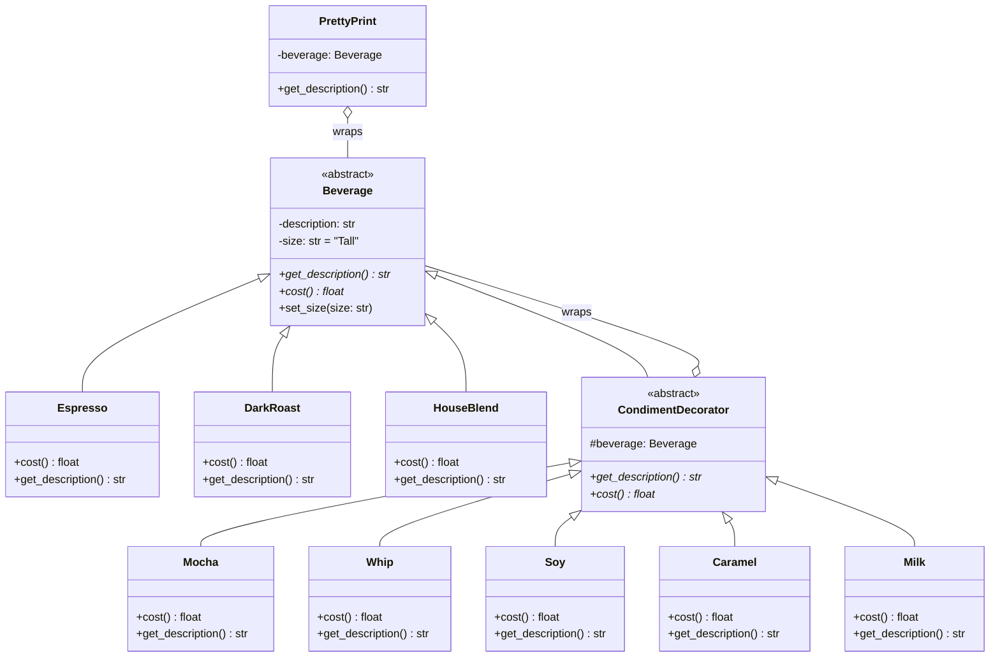

# Patrón Decorator - UML

## Diagrama de Clases

## Descripción del Patrón

El **Patrón Decorator** permite agregar responsabilidades dinámicamente a objetos de manera flexible. En este caso:

- **Beverage**: Clase abstracta que representa cualquier bebida
- **Espresso, DarkRoast, HouseBlend**: Bebidas concretas base
- **CondimentDecorator**: Clase abstracta que envuelve un Beverage y agrega funcionalidades
- **Mocha, Whip, Soy, Caramel, Milk**: Condimentos que decoran las bebidas
- **PrettyPrint**: Decorador adicional para formatear descripciones
