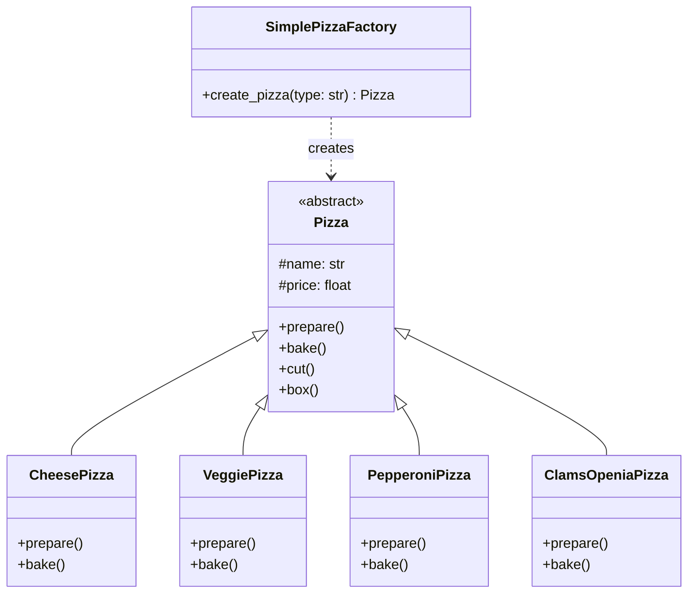
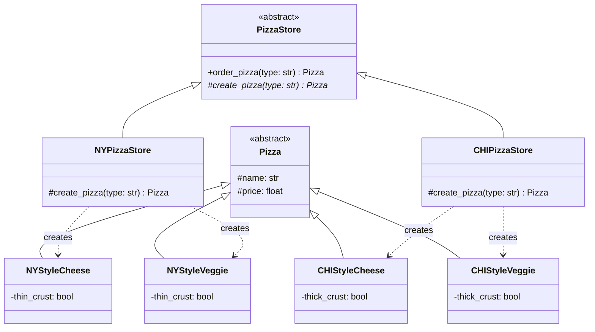
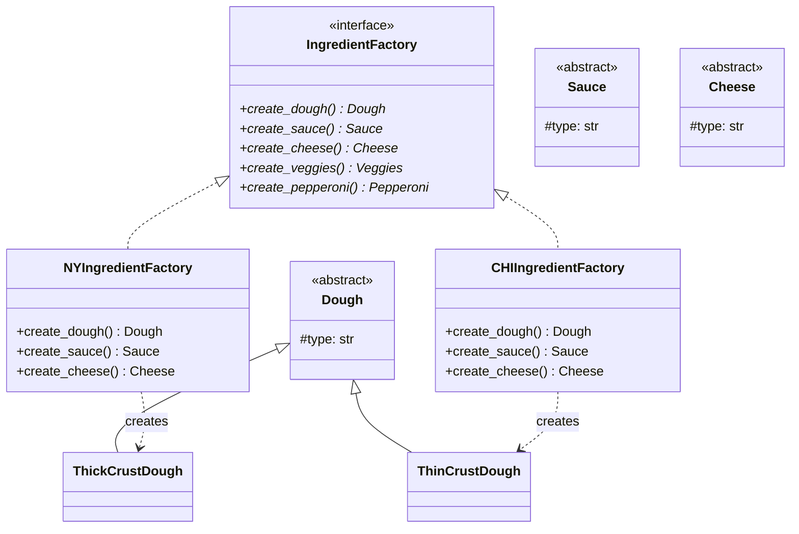

# Patrón Factory - UML

## Diagrama de Clases - Simple Factory

```mermaid
classDiagram
    class SimplePizzaFactory {
        +create_pizza(type: str) Pizza
    }
    
    class Pizza {
        <<abstract>>
        #name: str
        #price: float
        +prepare()
        +bake()
        +cut()
        +box()
    }
    
    class CheesePizza {
        +prepare()
        +bake()
    }
    
    class VeggiePizza {
        +prepare()
        +bake()
    }
    
    class PepperoniPizza {
        +prepare()
        +bake()
    }
    
    class ClamsOpeniaPizza {
        +prepare()
        +bake()
    }
    
    SimplePizzaFactory ..> Pizza : creates
    Pizza <|-- CheesePizza
    Pizza <|-- VeggiePizza
    Pizza <|-- PepperoniPizza
    Pizza <|-- ClamsOpeniaPizza
```

## Diagrama de Clases - Factory Method

```mermaid
classDiagram
    class PizzaStore {
        <<abstract>>
        +order_pizza(type: str) Pizza
        #create_pizza(type: str)* Pizza
    }
    
    class NYPizzaStore {
        #create_pizza(type: str) Pizza
    }
    
    class CHIPizzaStore {
        #create_pizza(type: str) Pizza
    }
    
    class Pizza {
        <<abstract>>
        #name: str
        #price: float
    }
    
    class NYStyleCheese {
        -thin_crust: bool
    }
    
    class NYStyleVeggie {
        -thin_crust: bool
    }
    
    class CHIStyleCheese {
        -thick_crust: bool
    }
    
    class CHIStyleVeggie {
        -thick_crust: bool
    }
    
    PizzaStore <|-- NYPizzaStore
    PizzaStore <|-- CHIPizzaStore
    Pizza <|-- NYStyleCheese
    Pizza <|-- NYStyleVeggie
    Pizza <|-- CHIStyleCheese
    Pizza <|-- CHIStyleVeggie
    
    NYPizzaStore ..> NYStyleCheese : creates
    NYPizzaStore ..> NYStyleVeggie : creates
    CHIPizzaStore ..> CHIStyleCheese : creates
    CHIPizzaStore ..> CHIStyleVeggie : creates
```

## Diagrama de Clases - Abstract Factory

```mermaid
classDiagram
    class IngredientFactory {
        <<interface>>
        +create_dough()* Dough
        +create_sauce()* Sauce
        +create_cheese()* Cheese
        +create_veggies()* Veggies
        +create_pepperoni()* Pepperoni
    }
    
    class NYIngredientFactory {
        +create_dough() Dough
        +create_sauce() Sauce
        +create_cheese() Cheese
    }
    
    class CHIIngredientFactory {
        +create_dough() Dough
        +create_sauce() Sauce
        +create_cheese() Cheese
    }
    
    class Dough {
        <<abstract>>
        #type: str
    }
    
    class ThickCrustDough {
    }
    
    class ThinCrustDough {
    }
    
    class Sauce {
        <<abstract>>
        #type: str
    }
    
    class Cheese {
        <<abstract>>
        #type: str
    }
    
    IngredientFactory <|.. NYIngredientFactory
    IngredientFactory <|.. CHIIngredientFactory
    
    Dough <|-- ThickCrustDough
    Dough <|-- ThinCrustDough
    
    NYIngredientFactory ..> ThickCrustDough : creates
    CHIIngredientFactory ..> ThinCrustDough : creates
```
