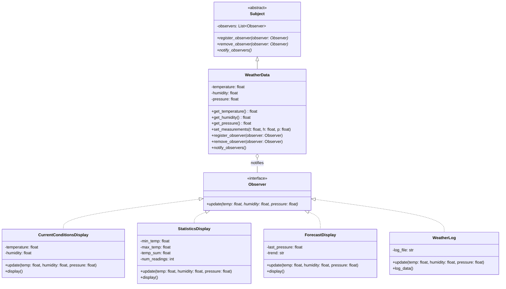

# Patrón Observer - UML

## Diagrama de Clases

## Componentes Principales

1. **Subject (WeatherData)**
   - Mantiene una lista de observadores
   - Notifica a todos cuando su estado cambia
   - Permite registrar y desregistrar observadores

2. **Observer (Interfaz)**
   - Define el método `update()` que será llamado por el Subject
   - Los observadores concretos implementan esta interfaz

3. **Observadores Concretos**
   - `CurrentConditionsDisplay`: Muestra condiciones actuales
   - `StatisticsDisplay`: Calcula estadísticas
   - `ForecastDisplay`: Predice tendencias futuras
   - `WeatherLog`: Registra datos en un archivo
